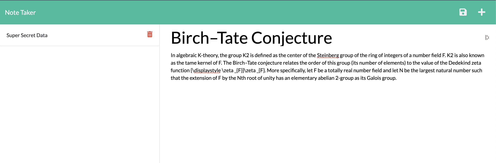

# Notetaker App

## Description
- The purpose of this application is to be a note-taking environment. 
- The user can input notes, save notes, access prior written notes, and delete notes through this application. 

## How To Use
- Visit the deployed application on Heroku.
- Write note in teh section available for note-taking, and when done click the save icon in the upper right hand corner. 
- To initiate a new note, click the plus sign in the upper right hand corner.
- To view an old note, simply select it from the left hand column. 
- To delete a note, click the red trash can. 

## Screenshot

## Deployed
https://stark-lake-38210.herokuapp.com/

## License
MIT
